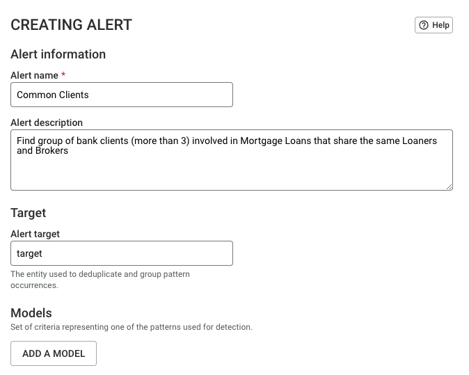

<!-- omit in toc -->
# AML Dataset implementation guide

<!-- omit in toc -->
### Prerequisites: 
- a Neo4j v4 server with `admin` or `architect` access rights (minimum supported version: v4.2)
- APOC procedures are enabled in Neo4j (more information [here](https://neo4j.com/labs/apoc/))
- a Linkurious Enterprise 3.0.4 or higher with `admin` access rights ([getting started guide](https://doc.linkurio.us/admin-manual/latest/getting-started/))

<!-- auto generated with https://marketplace.visualstudio.com/items?itemName=yzhang.markdown-all-in-one -->
<!-- omit in toc -->
## Topics:
- [1. Importing the data in Neo4j](#1-importing-the-data-in-neo4j)
- [2. Adding the datasource in Linkurious Enterprise](#2-adding-the-datasource-in-linkurious-enterprise)
- [3. Setting default styles](#3-setting-default-styles)
- [4. Setting default captions](#4-setting-default-captions)
- [5. Setting queries](#5-setting-queries)
- [6. Setting alerts](#6-setting-alerts)
- [7. Setting custom actions](#7-setting-custom-actions)
  - [How to retrieve the ID of a query](#how-to-retrieve-the-id-of-a-query)
- [8. Setting the plugin](#8-setting-the-plugin)

## 1. Importing the data in Neo4j
1. Login to Neo4j Browser with an user having read/write access
2. On the `Browser settings` panel, enable, if it's not, the `Enable multi statement query editor` option

   
3. Copy the whole content of the `scripts/import.cypher` file and paste it in the Neo4j query field
4. Run the query and wait
5. *(Optional)* If you want to check the import results, run `:sysinfo` as a query and compare the number of nodes/edges in your database with the following table:

   
6. Done!

## 2. Adding the datasource in Linkurious Enterprise
1. Login to Linkurious Enterpise with an user having admin access
2. Go to `Admin` -> `Data-sources management` panel and click on `ADD A DATA SOURCE`
3. Fill these fields with the following values:
    - GRAPH SERVER
        - **Name**: AML
        - **Vendor**: Neo4j
        - **URL**: *\<url:port>* (a stable idenfier for your Neo4j server)
        - **Username**: *\<yourUsername\>* (your Neo4j read/write user)
        - **Password**: *\<yourPassword\>* (your Neo4j read/write password)
    - Other
        - **Alternative node ID**: uid
        - **Alternative edge ID**: uid
    - SEARCH INDEX SERVER
        - **Vendor**: Neo4j Search
4. Click on `SAVE CONFIGURATION`
5. Start the indexing process by pressing `START` and wait
6. Done!

## 3. Setting default styles
1. Go to `Admin` -> `Data-source settings` panel
2. Scroll to the `Default styles` field and replace the whole content with the content of the `lke-configurations/default-styles.json` file
3. Click on `Save`
4. Done!

## 4. Setting default captions
1. Go to `Admin` -> `Data-source settings` panel
2. Scroll to the `Default captions` field and replace the whole content with the content of the `lke-configurations/default-captions.json` file
3. Click on `Save`
4. Done!

## 5. Setting queries
All the *Standard Queries* and *Query Templates* are contained in the `lke-configurations/queries.cypher` file

Repeat this procedure for every query in the file:
1. Open the *query editor* panel (more information [here](https://doc.linkurio.us/user-manual/latest/query-templates/#managing-queries-and-templates))
2. Copy the query from the file and paste it in the `Write a query or a template` field
3. Click on `Save`
4. Fill the `Name` and `Description` fields with the values provided in the file
5. Click on `Save` again
   
   > Example:
   >
   > This is how the query should look like
   > 
   > 
   > 
   > NOTE: `Query ID` may be different in your case
6. Done!

## 6. Setting alerts
All the *Alerts* are contained in the `lke-configurations/alerts.cypher` file

Repeat this procedure for every alert in the file:
1. On the *Alert dashboard*, click `CREATE NEW ALERT` (more information [here](https://doc.linkurio.us/user-manual/latest/alert-dashboard/)).
2. Fill the `Alert name` field with the value provided in the file
3. Fill the `Description` field with the description provided in the file
4. Turn on, if it's not, the `Enable` toggle
   
   
5. Turn on the `Share alert` toggle and select if you want to share it with all the users or with specific groups
6. Copy the query from the file and paste it in the `Query` field
7. Copy the target value from the file and paste it in the `Target` field
8. Click on `ADD A COLUMN` and fill the fields with the values provided in the file

   *NOTE: repeat this step if more columns are specified in the file*

9. Click on `Save` 
10. Done!

## 7. Setting custom actions
All the *Custom actions* are contained in the `lke-configurations/custom-actions.txt` file

Repeat this procedure for every custom action in the file:
1. Open the *Custom action* panel (more information [here](https://doc.linkurio.us/user-manual/2.9.1/custom-actions/#managing-custom-actions))
2. Click on `NEW CUSTOM ACTION`
3. Fill the `Custom action name`, `URL template` and `Description` fields with the values provided in the file
4. If any, replace *\<xxx\>* with the *id* of the query indicated in the file (read [How to retrieve the ID of a query](#how-to-retrieve-the-id-of-a-query) section)
5. Click on `SAVE`
   
   > Example:
   >
   > This is how the custom action should look like
   > 
   > 
   > 
   > NOTE: `queryID` value may be different in your case
6. Done!

### How to retrieve the ID of a query ##
1. Open the *QUERIES* panel (more information [here](https://doc.linkurio.us/user-manual/latest/query-templates/#managing-queries-and-templates))
2. Identify the desired query
3. Click on `More` and then on `View details...`
4. The `queryID` is now displayed

   

## 8. Setting the plugin
1. Download the data-table plugin available [here](https://github.com/Linkurious/lke-plugin-data-table/releases/latest) (documentation available [here](https://github.com/Linkurious/lke-plugin-data-table#readme)).
2. Copy the `.lke` archive in the folder `<lke-server>/data/plugins`
3. On Linkurious Enterprise dashboard, go to `Admin` -> `Global configuration`
4. Scroll to the `Plugin settings` field
5. If there are no other plugins configured here, replace the whole content of the field with the content of the `lke-configurations/plugins.json` file and skip to step 8.

   Otherwise, go to step 6

6. Copy the whole content of the `lke-configurations/plugins.json` file **except** for the `{` at the beginning and for the `}` at the end of the file
7. On the `Plugin settings` field, add an new empty line before the last `}`, add in this line a comma (`,`) and, after the comma, paste the content copied in the step 6
8. Click on `Save`
9. On Linkurious Enterprise dashboard, go to `Admin` -> `Data-source Schema`
10. Scroll to the end of `NODES CATEGORIES & EDGES TYPES` list and click on `Create new categories`
    
11. Type `REALESTATE_TRANSACTION` and click on `SAVE`
12. Select the category you just created and, by clicking on `Create a new property`, create properties as following:
    | Name             | Type     | Parameter                                     |
    |------------------|----------|-----------------------------------------------|
    | address          | string   |                                               |
    | avg_sqft_price   | currency | symbol: `$`; format: `#.###,## [Symbol]`      |
    | city             | string   |                                               |
    | contract_id      | string   |                                               |
    | price_range      | enum     | values: `OVERPRICED`, `UNDERPRICED`, `NORMAL` |
    | purchase_price   | currency | symbol: `$`; format: `#.###,## [Symbol]`      |
    | sqft             | number   |                                               |
    | sqft_price       | currency | symbol: `$`; format: `#.###,## [Symbol]`      |
    | transaction_date | date     | format: `yyyy-mm-dd`                          |
    | type             | string   |                                               |
13. Done!
